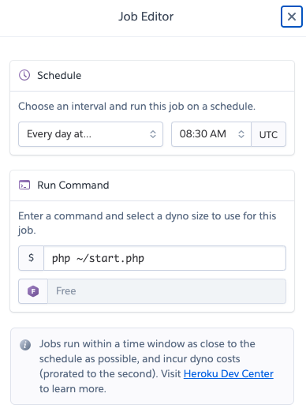

# ordering-bot
## なにをするもの？
- heroku(php) で動きます
- heroku schedulerと組み合わせて平日のときのみカンマ区切りの文字列をシャッフルしてIncoming Webhookに流します

## 使い方

[Heroku Toolbelt](https://toolbelt.heroku.com/) をインストールしておく。

```sh
$ git clone git@github.com:heroku/php-getting-started.git # またはFork済みのものをcloneする
$ cd ordering-bot
$ heroku create
$ git push heroku master
```

### 設定
```sh
# SlackのIncoming Webhookから払い出されるURLを設定する
$ heroku config:set WEBHOOK_URL="https://..."

# シャッフル対象の値をカンマ区切りでいれる（半角スペースは不要）
$ heroku config:set MEMBERS="alice,bob,charlie,david"
```

### 投稿チェック
```sh
$ heroku run worker 
```

### 毎日投稿する
[Heroku Scheduler](https://devcenter.heroku.com/articles/scheduler) を使う。

**NOTICE: 現在平日のみに実行する設定をハードコードしているため土日祝日に実行すると動きません**

毎日17:30(UTC)に設定する例は以下の通り。



- Schedule: Every day at... 08:30 **(UTC)**
- Run Command: `php ~/start.php`


## 参照

PHP, herokuに関する記事は以下を参照してください。

- [Getting Started with PHP on Heroku](https://devcenter.heroku.com/articles/getting-started-with-php)
- [PHP on Heroku](https://devcenter.heroku.com/categories/php)
